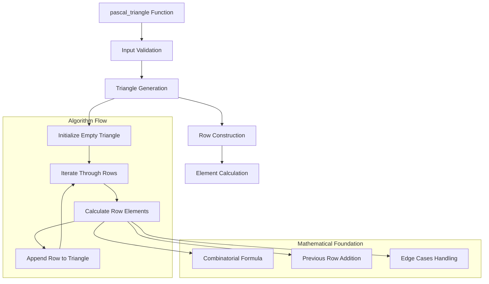

# Architecture Documentation

## Project: Pascal's Triangle

### Component Overview

This module implements Pascal's Triangle generation using dynamic programming principles. Pascal's Triangle is a triangular array of binomial coefficients where each row represents the coefficients of the binomial expansion (x+y)^n.

### Architecture Diagram

### Implementation Details

#### Core Algorithm
- **Dynamic Programming**: Each row built from the previous row
- **Time Complexity**: O(n²) where n is the number of rows
- **Space Complexity**: O(n²) for storing the complete triangle
- **Mathematical Basis**: C(n,k) = C(n-1,k-1) + C(n-1,k)

#### Data Flow
1. **Input Validation**: Check if n > 0
2. **Base Case**: Handle n <= 0 by returning empty list
3. **Iterative Construction**: Build each row using previous row values
4. **Edge Handling**: First and last elements of each row are always 1

### Performance Characteristics

#### Efficiency Metrics
- **Time Complexity**: O(n²) - optimal for generating complete triangle
- **Space Complexity**: O(n²) - stores all generated rows
- **Memory Usage**: Efficient list operations with minimal overhead
- **Scalability**: Handles large values of n efficiently

#### Optimization Features
- **In-place Construction**: Builds triangle incrementally
- **Minimal Calculations**: Reuses previous row data
- **Edge Case Optimization**: Special handling for triangle boundaries

### Security Considerations

#### Input Validation
- **Type Safety**: Ensures n is an integer
- **Boundary Checks**: Handles negative and zero inputs
- **Memory Safety**: Prevents excessive memory allocation

### Design Decisions

#### Implementation Choices
1. **List of Lists**: Natural representation of triangular structure
2. **Iterative Approach**: More memory efficient than recursive
3. **Dynamic Programming**: Optimal time complexity for the problem
4. **Edge Case Handling**: Robust input validation

#### Trade-offs
- **Memory vs Computation**: Stores all rows vs recalculating
- **Simplicity vs Optimization**: Clear code vs micro-optimizations
- **Flexibility vs Specificity**: General solution vs specialized cases

---

*This implementation provides an efficient and robust solution for Pascal's Triangle generation, suitable for interview scenarios and educational purposes.*
