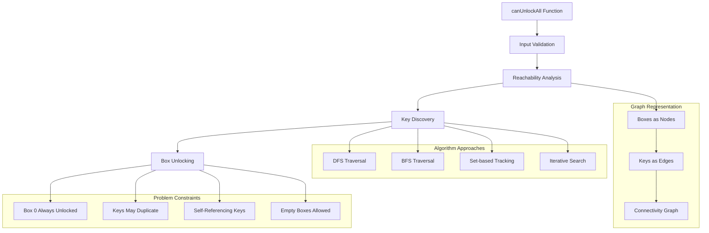

# Architecture Documentation

## Project: Lockboxes

### Component Overview

This module solves the lockboxes problem, determining whether all boxes can be unlocked given a set of boxes where each box contains keys to other boxes. This is a classic graph connectivity problem that tests understanding of graph traversal algorithms and reachability analysis.

### Architecture Diagram

### Implementation Details

#### Core Algorithm
- **Graph Connectivity**: Treats boxes as nodes and keys as directed edges
- **Reachability Problem**: Determines if all nodes are reachable from node 0
- **Time Complexity**: O(n + k) where n is boxes and k is total keys
- **Space Complexity**: O(n) for tracking visited boxes

#### Data Flow
1. **Input Validation**: Verify boxes is a valid list
2. **Initial State**: Box 0 is always unlocked (starting point)
3. **Key Collection**: Gather all accessible keys from unlocked boxes
4. **Traversal**: Use keys to unlock new boxes and collect more keys
5. **Termination**: Check if all boxes have been unlocked

### Performance Characteristics

#### Efficiency Metrics
- **Time Complexity**: O(n + k) - linear in boxes and keys
- **Space Complexity**: O(n) - tracks visited boxes
- **Optimal Solution**: Single pass through reachable boxes
- **Early Termination**: Can stop when no new boxes can be unlocked

#### Optimization Features
- **Visited Tracking**: Prevents redundant box processing
- **Key Deduplication**: Avoids processing duplicate keys
- **Graph Pruning**: Ignores invalid or self-referencing keys

### Security Considerations

#### Input Validation
- **Type Safety**: Ensures input is a list of lists
- **Structure Validation**: Verifies nested list structure
- **Boundary Checks**: Handles empty lists and edge cases
- **Key Validation**: Ensures keys are valid box indices

### Design Decisions

#### Implementation Choices
1. **Graph-based Approach**: Models problem as graph connectivity
2. **Iterative Solution**: Avoids recursion depth issues
3. **Set-based Tracking**: Efficient duplicate prevention
4. **Early Termination**: Optimization for unsolvable cases

#### Algorithm Variations
1. **Depth-First Search**: Recursive exploration of boxes
2. **Breadth-First Search**: Level-order box unlocking
3. **Union-Find**: Disjoint set data structure approach
4. **Dynamic Programming**: Memoized reachability

#### Trade-offs
- **Memory vs Time**: Tracking visited vs recomputation
- **Simplicity vs Optimization**: Clear logic vs micro-optimizations
- **Robustness vs Performance**: Input validation vs speed

### Common Interview Variations

#### Problem Extensions
- **Minimum Keys**: Find minimum keys needed to unlock all boxes
- **Optimal Path**: Determine shortest unlocking sequence
- **Multiple Start Points**: Generalize to multiple initial boxes
- **Weighted Boxes**: Add costs or rewards to box unlocking

#### Alternative Approaches
- **Recursive DFS**: Tree-based exploration
- **BFS with Queue**: Level-order processing
- **Matrix Representation**: Adjacency matrix approach
- **Bitwise Tracking**: Compact state representation

---

*This implementation demonstrates graph connectivity concepts essential for technical interviews, focusing on reachability analysis and efficient traversal algorithms.*
