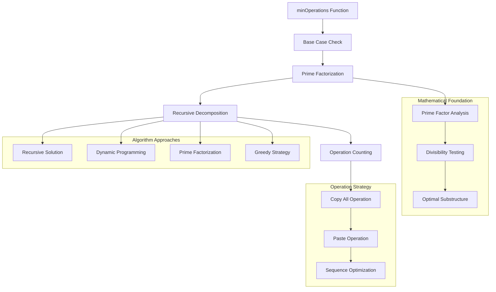

# Architecture Documentation

## Project: Minimum Operations

### Component Overview

This module solves the minimum operations problem, which involves finding the minimum number of operations needed to result in exactly n 'H' characters in a file, starting with a single 'H'. The only allowed operations are "Copy All" and "Paste". This is a mathematical optimization problem that demonstrates prime factorization and dynamic programming concepts.

### Architecture Diagram

### Implementation Details

#### Core Algorithm
- **Prime Factorization**: Decomposes n into prime factors
- **Recursive Strategy**: Breaks problem into smaller subproblems
- **Time Complexity**: O(√n) for finding first prime factor
- **Space Complexity**: O(log n) for recursion depth

#### Mathematical Insight
The key insight is that to reach n characters optimally:
1. Find the smallest prime factor p of n
2. The optimal strategy is to reach n/p characters, then copy and paste (p-1) times
3. Total operations = minOperations(n/p) + p

#### Data Flow
1. **Base Case**: If n ≤ 1, return 0 (no operations needed)
2. **Factor Finding**: Find smallest prime factor of n
3. **Recursive Call**: Solve for n divided by the factor
4. **Operation Count**: Add the factor to the recursive result

### Performance Characteristics

#### Efficiency Metrics
- **Time Complexity**: O(√n) worst case for prime numbers
- **Space Complexity**: O(log n) for recursion stack
- **Optimal Solution**: Mathematically proven minimum operations
- **Early Termination**: Stops at first found factor

#### Optimization Features
- **Prime Factor Approach**: Leverages mathematical properties
- **Recursive Memoization**: Can be enhanced with caching
- **Early Exit**: Returns immediately for base cases

### Security Considerations

#### Input Validation
- **Boundary Checks**: Handles n ≤ 1 appropriately
- **Type Safety**: Assumes integer input
- **Overflow Protection**: Safe for large n values within reason

### Design Decisions

#### Implementation Choices
1. **Recursive Approach**: Natural problem decomposition
2. **Prime Factorization**: Mathematically optimal strategy
3. **Smallest Factor First**: Ensures minimum operations
4. **Simple Logic**: Clear and understandable algorithm

#### Mathematical Strategy
- **Copy-Paste Sequence**: Optimal is copy once, paste (p-1) times
- **Factor Selection**: Smallest prime factor gives minimum operations
- **Recursive Structure**: Optimal substructure property

#### Alternative Approaches
1. **Dynamic Programming**: Bottom-up table approach
2. **Complete Factorization**: Find all prime factors at once
3. **Iterative Solution**: Replace recursion with iteration
4. **Memoization**: Cache results for repeated subproblems

### Mathematical Analysis

#### Problem Breakdown
For n characters using Copy All + Paste operations:
- To get k characters: Copy (1 op) + Paste k-1 times = k operations total
- Optimal strategy: Factor n = p₁ × p₂ × ... × pₖ
- Minimum operations = p₁ + p₂ + ... + pₖ (sum of prime factors)

#### Proof of Optimality
- Any sequence of Copy All + Paste can be viewed as multiplication
- To reach n efficiently, we need the smallest sum of factors that multiply to n
- This is achieved by the sum of prime factors (fundamental theorem of arithmetic)

### Interview Insights

#### Key Concepts Demonstrated
- **Mathematical Optimization**: Finding optimal mathematical strategy
- **Prime Factorization**: Understanding number theory
- **Dynamic Programming**: Optimal substructure and recursion
- **Greedy Choice**: Taking locally optimal decisions

#### Discussion Points
- Why prime factorization works
- Time complexity analysis
- Alternative solution approaches
- Real-world applications of the pattern

---

*This implementation showcases the intersection of mathematics and computer science, demonstrating how number theory can lead to elegant algorithmic solutions.*
