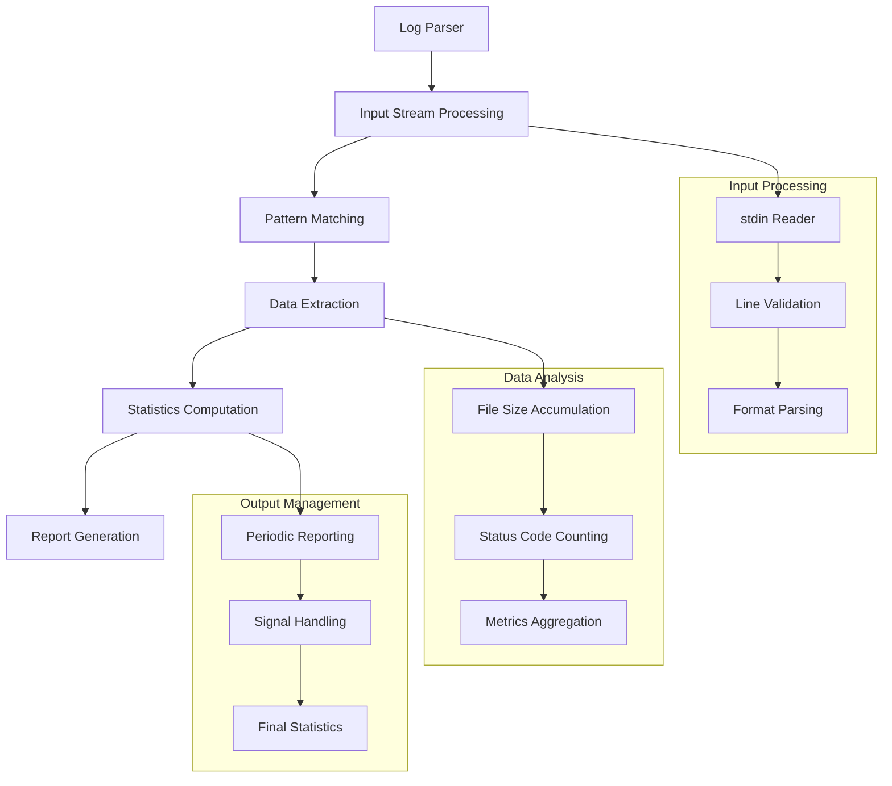

# Architecture Documentation

## Project: Log Parsing

### Component Overview

This module implements real-time log parsing and statistics computation, processing HTTP access logs in a specific format and computing metrics on-the-fly. It demonstrates stream processing, signal handling, and statistical analysis of incoming data.

### Architecture Diagram

### Implementation Details

#### Core Algorithm
- **Stream Processing**: Real-time log line processing
- **Pattern Matching**: Regular expression or string parsing
- **Signal Handling**: SIGINT (Ctrl+C) graceful termination
- **Periodic Output**: Statistics every 10 lines

#### Data Flow
1. **Input Reading**: Read lines from stdin continuously
2. **Format Validation**: Check log format compliance
3. **Data Extraction**: Extract file size and status code
4. **Statistics Update**: Accumulate metrics
5. **Periodic Reporting**: Output stats every 10 lines or on interrupt

### Performance Characteristics

#### Efficiency Metrics
- **Time Complexity**: O(1) per log line processing
- **Space Complexity**: O(1) for status code counting
- **Memory Usage**: Constant space for metrics storage
- **Throughput**: High-performance stream processing

---

*This implementation demonstrates real-time data processing and statistical analysis patterns commonly used in system monitoring and log analysis applications.*
