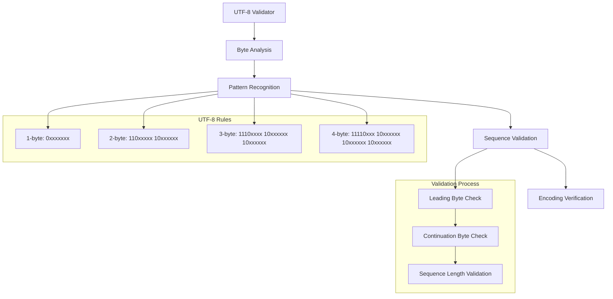

# Architecture Documentation

## Project: UTF-8 Validation

### Component Overview

This module implements UTF-8 character encoding validation, determining whether a given data set represents valid UTF-8 encoding. It demonstrates bit manipulation, character encoding understanding, and pattern recognition for multi-byte character sequences.

### Architecture Diagram

### Implementation Details

#### Core Algorithm
- **Bit Pattern Matching**: Validates UTF-8 byte patterns
- **State Machine**: Tracks multi-byte character sequences
- **Time Complexity**: O(n) where n is number of bytes
- **Space Complexity**: O(1) constant space usage

#### UTF-8 Encoding Rules
1. **1-byte characters**: 0xxxxxxx (ASCII)
2. **2-byte characters**: 110xxxxx 10xxxxxx
3. **3-byte characters**: 1110xxxx 10xxxxxx 10xxxxxx
4. **4-byte characters**: 11110xxx 10xxxxxx 10xxxxxx 10xxxxxx

---

*This implementation demonstrates bit manipulation and character encoding concepts essential for text processing and internationalization.*
