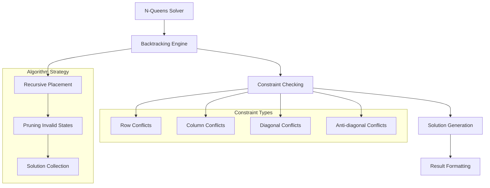

# Architecture Documentation

## Project: N-Queens

### Component Overview

This module solves the classic N-Queens problem using backtracking algorithms. The N-Queens problem involves placing N chess queens on an N×N chessboard so that no two queens attack each other, demonstrating constraint satisfaction and recursive problem-solving techniques.

### Architecture Diagram

### Implementation Details

#### Core Algorithm
- **Backtracking**: Systematic exploration with pruning
- **Constraint Satisfaction**: Queen placement validation
- **Time Complexity**: O(N!) factorial time complexity
- **Space Complexity**: O(N) for recursion and board state

#### Queen Attack Patterns
Queens attack horizontally, vertically, and diagonally, requiring careful constraint checking for valid placements.

---

*This implementation demonstrates advanced backtracking and constraint satisfaction algorithms essential for solving complex combinatorial problems.*
