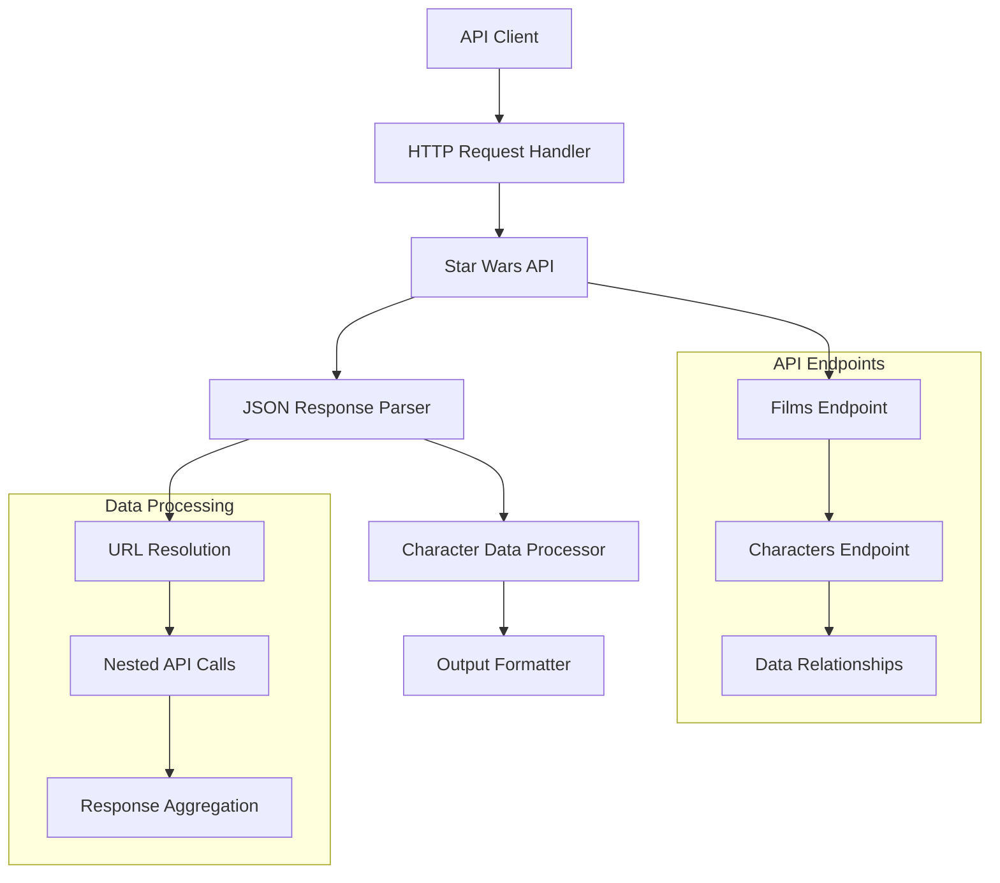

# Architecture Documentation

## Project: Star Wars API

### Component Overview

This module integrates with the Star Wars API to fetch and display character information for specific films. It demonstrates API consumption, asynchronous request handling, and data processing from external web services.

### Architecture Diagram

### Implementation Details

#### Core Features
- **API Integration**: RESTful Star Wars API consumption
- **Asynchronous Processing**: Handling multiple character requests
- **Data Transformation**: JSON parsing and character extraction
- **Error Handling**: Network and API error management

---

*This implementation showcases modern API integration patterns and asynchronous data processing techniques.*
