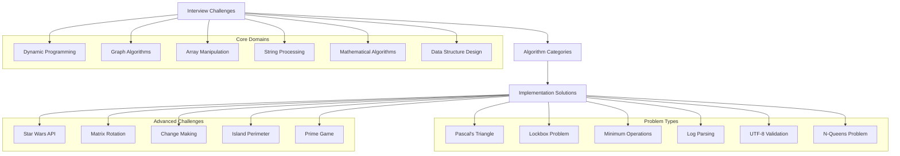
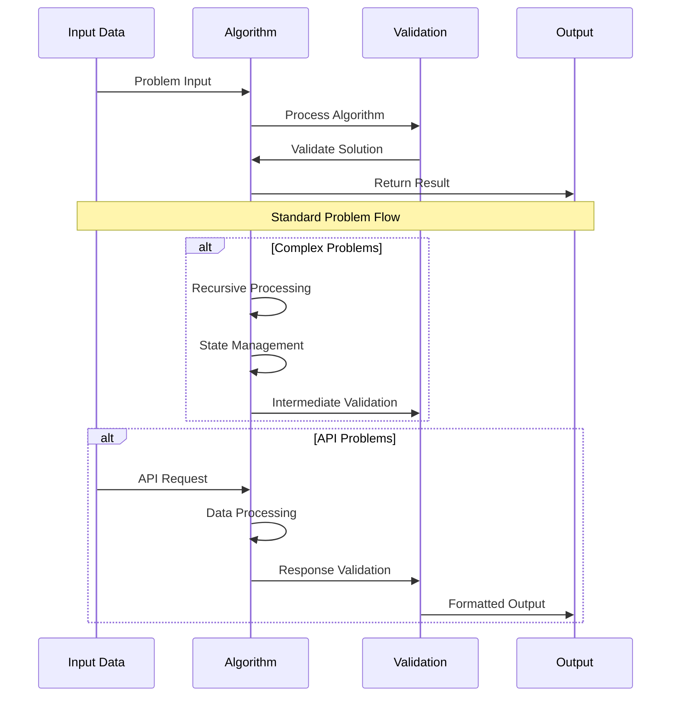

# Architecture Documentation

## Project: ALX Interview Preparation

### System Overview

The ALX Interview repository contains a comprehensive collection of algorithmic challenges and data structure implementations designed to prepare software engineering students for technical interviews. This repository focuses on fundamental computer science concepts, problem-solving techniques, and optimized algorithm implementations commonly encountered in technical interviews at top technology companies.

### Architecture Diagram



### Component Breakdown

#### Core Components

1. **Mathematical & Combinatorial**
   - **0x00-pascal_triangle**: Pascal's triangle generation
   - **0x02-minimum_operations**: Mathematical optimization
   - **0x0A-primegame**: Game theory and prime numbers

2. **Array & Matrix Processing**
   - **0x07-rotate_2d_matrix**: In-place matrix transformation
   - **0x09-island_perimeter**: Grid traversal algorithms

3. **Graph & Search Problems**
   - **0x01-lockboxes**: Graph connectivity and traversal
   - **0x05-nqueens**: Backtracking and constraint satisfaction

4. **String & Data Validation**
   - **0x03-log_parsing**: Real-time data processing
   - **0x04-utf8_validation**: Character encoding validation

5. **API Integration & External Systems**
   - **0x06-starwars_api**: RESTful API consumption and data processing

6. **Dynamic Programming**
   - **0x08-making_change**: Classic change-making optimization

### Data Flow Architecture



### Security Considerations

#### Input Validation
- **Type Checking**: Robust input parameter validation
- **Bounds Checking**: Array and matrix boundary validation
- **Edge Cases**: Comprehensive edge case handling
- **Data Sanitization**: Safe data processing practices

#### Algorithm Security
- **Time Complexity**: Prevention of algorithmic attacks
- **Memory Management**: Efficient memory usage
- **Stack Overflow**: Recursive depth management
- **Integer Overflow**: Safe mathematical operations

### API Design

#### Common Algorithm Interface
```python
# Standard function signature pattern
def algorithm_function(input_parameters):
    """
    Algorithm description and complexity analysis
    
    Args:
        input_parameters: Description of input format
        
    Returns:
        Expected output format and type
        
    Time Complexity: O(analysis)
    Space Complexity: O(analysis)
    """
    # Implementation
    return result
```

#### Validation Patterns
```python
# Input validation template
def validate_input(data):
    if not data or not isinstance(data, expected_type):
        return False
    # Additional validation logic
    return True
```

### Performance Metrics

#### Efficiency Targets
- **Time Complexity**: Optimal algorithmic complexity for each problem
- **Space Complexity**: Minimal memory footprint
- **Execution Time**: Fast algorithm execution for large inputs
- **Scalability**: Solutions handle maximum constraint limits

#### Optimization Strategies
- **Algorithm Selection**: Choosing optimal algorithms for each problem
- **Data Structure Optimization**: Efficient data structure usage
- **Memory Management**: Minimal space complexity
- **Edge Case Optimization**: Fast handling of special cases

### Design Decisions

#### Problem-Solving Approach
1. **Algorithmic Thinking**: Systematic problem decomposition
2. **Optimization Focus**: Time and space complexity optimization
3. **Code Quality**: Clean, readable, and maintainable code
4. **Testing Strategy**: Comprehensive test case coverage

#### Implementation Standards
1. **Python Best Practices**: PEP 8 compliance and pythonic code
2. **Documentation**: Clear docstrings and comments
3. **Error Handling**: Robust error management
4. **Modularity**: Reusable and testable functions

#### Trade-offs Considered
1. **Readability vs Performance**: Balancing code clarity with optimization
2. **Memory vs Time**: Space-time complexity trade-offs
3. **Simplicity vs Efficiency**: Educational clarity vs optimal solutions
4. **Generalization vs Specialization**: Generic vs problem-specific solutions

### Interview Preparation Framework

#### Problem Categories
1. **Arrays and Strings**: Fundamental data manipulation
2. **Dynamic Programming**: Optimization problems
3. **Graph Theory**: Traversal and connectivity
4. **Mathematical Algorithms**: Number theory and combinatorics
5. **System Design**: API integration and data processing

#### Skill Development
1. **Algorithmic Thinking**: Problem decomposition skills
2. **Code Implementation**: Clean coding practices
3. **Complexity Analysis**: Time and space analysis
4. **Communication**: Technical explanation abilities

### Testing and Validation

#### Test Coverage
- **Unit Tests**: Individual function testing
- **Integration Tests**: End-to-end problem solving
- **Edge Case Tests**: Boundary condition validation
- **Performance Tests**: Scalability and efficiency testing

#### Validation Criteria
- **Correctness**: Algorithm produces expected results
- **Efficiency**: Meets time and space complexity requirements
- **Robustness**: Handles edge cases and invalid inputs
- **Maintainability**: Code quality and documentation standards

### Future Enhancements

#### Planned Improvements
- **Additional Problem Sets**: More diverse algorithm challenges
- **Advanced Topics**: Machine learning and AI algorithms
- **Interactive Solutions**: Web-based problem solving platform
- **Performance Benchmarking**: Automated performance analysis

#### Scalability Considerations
- **Problem Difficulty Scaling**: Progressive difficulty levels
- **Language Support**: Multi-language implementations
- **Test Automation**: Comprehensive automated testing
- **Documentation Enhancement**: Interactive learning materials

---

*This architecture supports the ALX Software Engineering curriculum's interview preparation module, emphasizing practical algorithm implementation and technical interview readiness.*
